# Interface: Collection


- LinkedList is a very special one, but normally we don't use LinkedList in our project

## 1.0 Collection

### features

- no order
- element can be repeated

### Common method

- `public boolean add (E e)`
- `public boolean addAll(Collection<? extends E> c)`
- `public void clear ()`
- `public boolean remove (E e)`
- `public boolean contains(Object obj)` // why is the parameter Object not E?
- `public boolean isEmpty()`
- `public int size()`
- `public Object[] toArray()`

### Traversal

- iterator
- for
- lambda

## 1.1 List

### 1.1.0 List Interface

#### feature

- ordered, repeatable, indexed

#### common method

| method                          | describtion |
| ------------------------------- | ----------- |
| void add (int index, E element) |             |
| E remove (int index)            |             |
| E set (int index, E element)    |             |
| E get (int index)               |             |


### 1.1.1 ArrayList

> Details please look into the analysis of <u>source code</u> in [JavaGuide](https://javaguide.cn/java/collection/arraylist-source-code.html#arraylist-核心源码解读) 
> I started to write my own notes from the note from JavaGuide and then add my own consideration. I did translation as well because JavaGuide is only written in chinese

#### 1.1.1.1 Interface, Inheritance
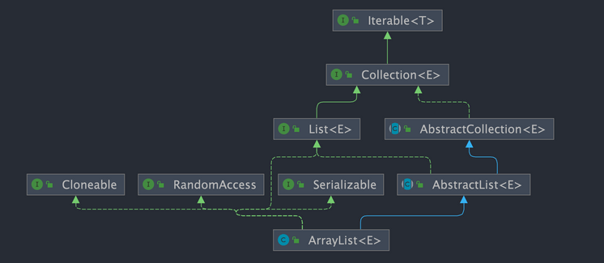

- extends and implements
    ```java
    public class ArrayList<E> extends AbstractList<E> implements List<E>, RandomAccess, Cloneable, java.io.Serializable {}
    ```
    - `extends AbstractList<E>` and `implements List<E>`
        - ==> a list ==> add, remove, set, get through index
    - `implements RandomAccess`
        - a marker interface (contains no method) ==> support fast (generally constant-time) random access to elements
    - `implements Cloneable`
        - a marker interface
        - can be cloned/copied (deep or shadow)
    - `implements java.io.Serializable`
        - it can perform serialization operations, that is, it can be converted into a stream of bytes for persistent storage or network transmission, which is very convenient


#### 1.1.1.2 Basic Features

- base on array, dynamic array
    - search with index ==> very fast
    - add, delete element ==> very slow
- capacity is dynamic
- generic supported
- only Objects can be stored (wrapper, no primitive)
- no need to assign the length when create
- `null` supported, but meaningless, better don't use
    ```java
    ArrayList<String> listOfString = new ArrayList<>();
    listOfString.add(null);
    listOfString.add("java");
    System.out.println(listOfString); // [null, java]
    ```
- write `List<String> listOfString = new ArrayList<>();` instead of `ArrayList<String> listOfString = new ArrayList<>();`
    - `List<String> listOfString = new ArrayList<>();` is programming to an interface (List<E>), this allows you to switch to another implementation easily, for example LinkedList
    - 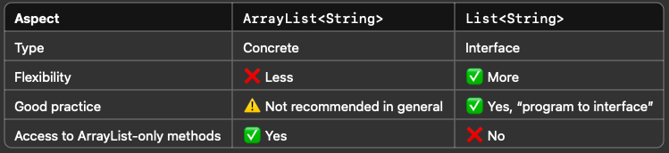

#### 1.1.1.3 Time Complexity in `add` and `delete`

why?

- `add` from the head: $O(n)$
- `add` from the tail: $O(1)$
- `add` in the middle: $O(n)$
- `delete` from the head: $O(n)$
- `delete` from the tail: $O(1)$
- `delete` in the middle: $O(n)$

#### 1.1.1.4 Capacity expansion mechanism

- increase the capacity of a list when reach to the max

- constructor

    ```java
    // init capacity by default = 10
    private static final int DEFAULT_CAPACITY = 10;
    // ???
    private static final Object[] DEFAULTCAPACITY_EMPTY_ELEMENTDATA = {};

    // by default: constructor without parameters
    // what happens when List<String> list = new ArrayList<>();?
    // list will not get an array with 10 capacity, instead of that list will be assigned the address and a empty object array. DEFAULTCAPACITY_EMPTY_ELEMENTDATA is a Object[] (an empty object array).
    // only when you add the first element in the list, it will be assigned 10 capacity, see in the add method below
    public ArrayList() {
        this.elementData = DEFAULTCAPACITY_EMPTY_ELEMENTDATA;
    }

    // constructor with user-defined capacity (initialCapacity)
    public ArrayList(int initialCapacity) {
        // if initialCapacity greater than 0
        // then: create an array with the length initialCapacity and store Object ==> new Object[initialCapacity]
        if (initialCapacity > 0) {
            this.elementData = new Object[initialCapacity];
        } else if (initialCapacity == 0) {
            // if initialCapacity is 0, then create empty array
            this.elementData = EMPTY_ELEMENTDATA;
        } else {
            // if smaller than 0 then exception
            throw new IllegalArgumentException("Illegal Capacity: " + initialCapacity);
        }
    }

    /**
    *构造包含指定collection元素的列表，这些元素利用该集合的迭代器按顺序返回
    *如果指定的集合为null，throws NullPointerException。
    */
    /**
    ???
    constructor with Collection as parameter
    */
    public ArrayList(Collection<? extends E> c) {
        elementData = c.toArray();
        if ((size = elementData.length) != 0) {
            // c.toArray might (incorrectly) not return Object[] (see 6260652)
            if (elementData.getClass() != Object[].class)
                elementData = Arrays.copyOf(elementData, size, Object[].class);
        } else {
            // replace with empty array.
            this.elementData = EMPTY_ELEMENTDATA;
        }
    }
    ```

- add
    ```java
    // add element from the tail
    public boolean add(E e) {
        // 1. invoke ensureCapacityInternal method before add elements
        ensureCapacityInternal(size + 1);  // Increments modCount!!
        // 这里看到ArrayList添加元素的实质就相当于为数组赋值
        elementData[size++] = e;
        return true;
    }

    // 2. ensure that internal capacity reach to min. capacity
    private void ensureCapacityInternal(int minCapacity) {
        ensureExplicitCapacity(calculateCapacity(elementData, minCapacity));
    }

    // 2.1 calculate how large the capacity it need, it returns min. capacity
    private static int calculateCapacity(Object[] elementData, int minCapacity) {
        // 如果当前数组元素为空数组（初始情况），返回默认容量和最小容量中的较大值作为所需容量
        // if it is empty array, return max. among default capacity (10) and min. capacity
        if (elementData == DEFAULTCAPACITY_EMPTY_ELEMENTDATA) {
            return Math.max(DEFAULT_CAPACITY, minCapacity);
        }
        // otherwise return minCapacity directly
        return minCapacity;
    }

    // 2.2 check if enlarge capacity is needed
    private void ensureExplicitCapacity(int minCapacity) {
        modCount++;
        // 2.2.1 is the capacity of the current array enough to store minCapacity elements
        // if yes, minCapacity - elementData.length <= 0, no need to invoke grow()
        // if no, invoke grow()
        if (minCapacity - elementData.length > 0)
            // enlarge capacity by invoking grow() method
            grow(minCapacity);
    }
    ```

- grow: core method to enlarge capacity
    - every time after capacity enlarge the new capacity of the ArrayList will become 1.5 times of the old capacity
    ```java
    /**
    * 要分配的最大数组大小???
    */
    private static final int MAX_ARRAY_SIZE = Integer.MAX_VALUE - 8;

    /**
    * core method for ArrayList to enlarge capacity
    */
    private void grow(int minCapacity) {
        // oldCapacity为旧容量，newCapacity为新容量
        int oldCapacity = elementData.length;
        // 将oldCapacity 右移一位，其效果相当于oldCapacity /2，
        // 我们知道位运算的速度远远快于整除运算，整句运算式的结果就是将新容量更新为旧容量的1.5倍，
        int newCapacity = oldCapacity + (oldCapacity >> 1);

        // 然后检查新容量是否大于最小需要容量，若还是小于最小需要容量，那么就把最小需要容量当作数组的新容量，
        if (newCapacity - minCapacity < 0)
            newCapacity = minCapacity;

        // 如果新容量大于 MAX_ARRAY_SIZE,进入(执行) `hugeCapacity()` 方法来比较 minCapacity 和 MAX_ARRAY_SIZE，
        // 如果minCapacity大于最大容量，则新容量则为`Integer.MAX_VALUE`，否则，新容量大小则为 MAX_ARRAY_SIZE 即为 `Integer.MAX_VALUE - 8`。
        if (newCapacity - MAX_ARRAY_SIZE > 0)
            newCapacity = hugeCapacity(minCapacity);

        // minCapacity is usually close to size, so this is a win:
        elementData = Arrays.copyOf(elementData, newCapacity);
    }
    ```

#### 1.1.1.5 fail-fast, fail-safe

> Fail-fast systems are designed to immediately stop functioning upon encountering an unexpected condition. This immediate failure helps to catch errors early, making debugging more straightforward.
>
> ------
>
> 著作权归JavaGuide(javaguide.cn)所有 基于MIT协议 原文链接：https://javaguide.cn/java/collection/java-collection-questions-01.html

#### 1.1.1.6 ArrayList vs. LinkedList

### 1.1.2 LinkedList

> We don't use LinkedList!
>   


#### 1.1.2.1 Basic Features

- base on <u>double linked list</u>

- feature
    - search slow --> have to start the search from the head every time
    - add and delete fast --> change the node which link to previous and next node
    - very fast access to head and tail node in terms of add and delete

- Why can't LinkedList implement the RandomAccess interface?

- Common method for first and last node/element
    | method | description |
    |---     | ---         |
    |public void addFirst(E e) | | 
    |public void addLast(E e) | | 
    |public void getFirst(E e) | | 
    |public void getLast(E e) | | 
    |public void removeFirst(E e) | | 
    |public void removeLast(E e) | | 

    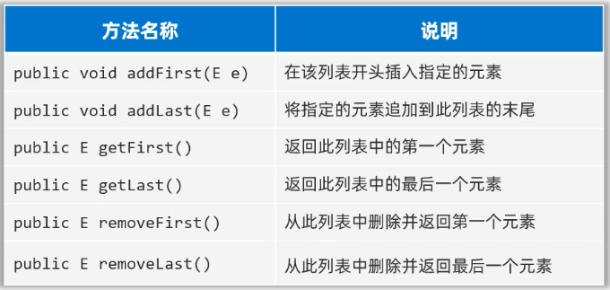


### ArrayList vs. LinkedList

| a                         | ArrayList                                                    | LinkedList                                   |
| ------------------------- | ------------------------------------------------------------ | -------------------------------------------- |
| thread-safe               | no                                                           | no                                           |
| underlying data structure | Object array                                                 | double linked list                           |
| fast random access        | no                                                           | yes, because of RandomAccess interface       |
| memory space consumption  | a certain amount of space is reserved at the end of the list | need to store the previous and next pointers |

- RandomAccess

    - source code of RandomAccess

    ```java
    public interface RandomAccess {
    }
    ```

    - a marker interface (doesn't have concrete function)
    ArrayList implements the RandomAccess interface, while LinkedList does not. Why is that? I think it still has to do with the underlying data structure! The base of ArrayList is an array, while the base of LinkedList is a linked list. Arrays naturally support random access, the time complexity is O(1), so it is called fast random access. Linked lists must be traversed to a specific location to access the elements at a specific location, the time complexity is O(n), so it does not support fast random access.ArrayList implements the RandomAccess interface, which indicates that it has fast random access. The RandomAccess interface is just an identifier, it doesn't mean that ArrayList has fast random access only if it implements the RandomAccess interface!


### List Summary

| a                                | Length/Size                                | Data Type         | Generics | API                      | safe threads            | Data Structure     | useful? |
| -------------------------------- | ------------------------------------------ | ----------------- | -------- | ------------------------ | ----------------------- | ------------------ | ------- |
| Array                            | 1. fixed with initial<br />2. can't change | primitive/wrapper | 0        | 0                        |                         |                    |         |
| ArrayList<br />--> dynamic array | expansion mechanism: `ensureCapacity()`    | wrapper           | 1        | 1. random accessible     | 0                       | `Object[]`         | 1       |
| LinkedList                       |                                            |                   |          | 1. not random accessible | 0                       | double linked list | 0       |
| Vector                           |                                            |                   |          |                          | 1 (with `synchronized`) | `Object[]`         | 0       |
| Stack                            |                                            |                   |          |                          |                         |                    | 0       |

## 1.2 Set

- unordered, no duplication, unindex
    - unordered access / ungeordneter Zugriff
    - can not store duplicate elements / keine Duplikate
    - not access through index / kein Zugriff über Index

- is implemented with Map (HashMap, LinkedHashMap, TreeMap), because the key in Map is unique
    - HashSet <== HashMap
    - LinkedHashSet <== LinkedHashMap
    - TreeSet <== TreeMap
    

|               | order | duplication | index | sort |
| ------------- | ----- | ----------- | ----- | ---- |
| HashSet       |       |             |       |      |
| LinkedHashSet |       |             |       |      |
| TreeSet       |       |             |       |      |


### 1.2.1 HashSet

#### 1.2.1.1 feature

- unordered, no duplication, no index
- not common to use in the project 
    - store elements in order ==> ArrayList or LinkedList
    - key-value ==> HashMap

#### 1.2.1.2 data structure

- Hash value (of the object) and Hash table

- How to implement HashSet through hash table

- array + linked list (before JDK 8)

    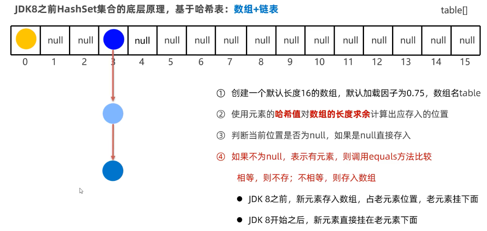

    - array + linked list + red-black tree (after JDK 8)

    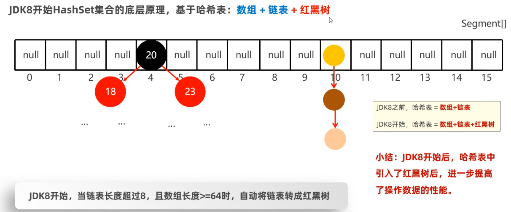

- CRUD
- HashSet is mainly used to remove duplicates, e.g. we need to count how many non-repeating words in an article, we can use HashSet to realize --> why can HashSet implement this? because of HashMap

```java
// new HashSet instance
HashSet<String> stringHashSet = new HashSet<>();
// add new elements
stringHashSet.add("jiang");
stringHashSet.add("lin");
stringHashSet.add("jiang");
// output
System.out.println(stringHashSet.size()); // 2, why?
```

- HashSet is implemented with HashMap. The key in HashMap is unique, when you add "jiang" second time, it will cover the first "jiang" ("jiang" is key)

#### 1.2.1.3 source code

- implement through HashMap (see source code)

```java
public class HashSet<E>
    extends AbstractSet<E>
    implements Set<E>, Cloneable, java.io.Serializable
{
    private transient HashMap<E,Object> map;

    // Dummy value to associate with an Object in the backing Map
    private static final Object PRESENT = new Object();

    public HashSet() {
        map = new HashMap<>();
    }

    // the value of the map is filled with dummy object
    public boolean add(E e) {
        return map.put(e, PRESENT)==null;
    }

    public boolean remove(Object o) {
        return map.remove(o)==PRESENT;
    }
}
```

#### how to check repeated elements?

- the `add` method in HashSet invokes `put` method of HashMap

```java
// Returns: true if this set did not already contain the specified element
public boolean add(E e) {
        return map.put(e, PRESENT)==null;
}
```

### 1.2.2 LinkedHashSet

- based on hash table (array, linked list, red-black tree)
  - add double linked list to record the previous and exceed node of the current node
  - 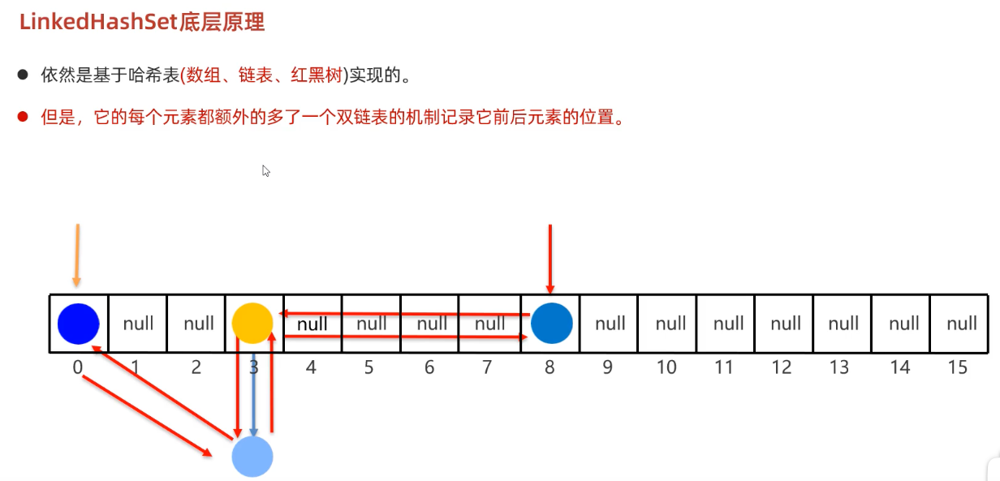

- implemented with LinkedHashMap

### 1.2.3 TreeSet

- implementing class of interface SortedSet

- How to sort?

  - Integer

  - String

  - Object

    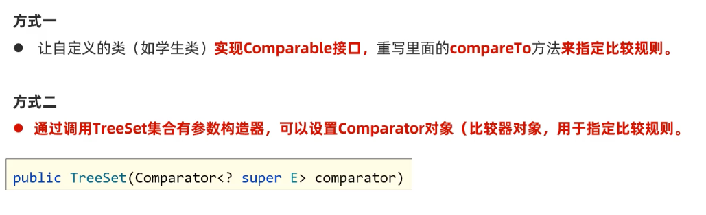

- implemented with TreeMap


## 1.3 Queue

### ArrayDeque

- underlying data structure: array
- 

### LinkedList vs. ArrayDeque

- LinkedList: implements also Deque interface

  ```java
  public class LinkedList<E> extends AbstractSequentialList<E> implements List<E>, Deque<E>, Cloneable, java.io.Serializable
  ```

- LinkedList implements List and Deque, i.e. LinkedList can be implemented as list or deque

### PriorityQueue

> `PriorityQueue` may appear more in the interview in the hands of the algorithm, typical examples of problems include heap sort, find the K-th largest number, traversal of weighted graphs, etc., so you need to be proficient in the use of it.

- In order to have priority, the element needs to implement the <u>Comparable</u> interface or the <u>Comparator</u> interface
- When to use? 
    - always needing the "top" element first
    - you want to quickly get the smallest/largest item without fully sorting


# Interface: Map

## 2.0 Map

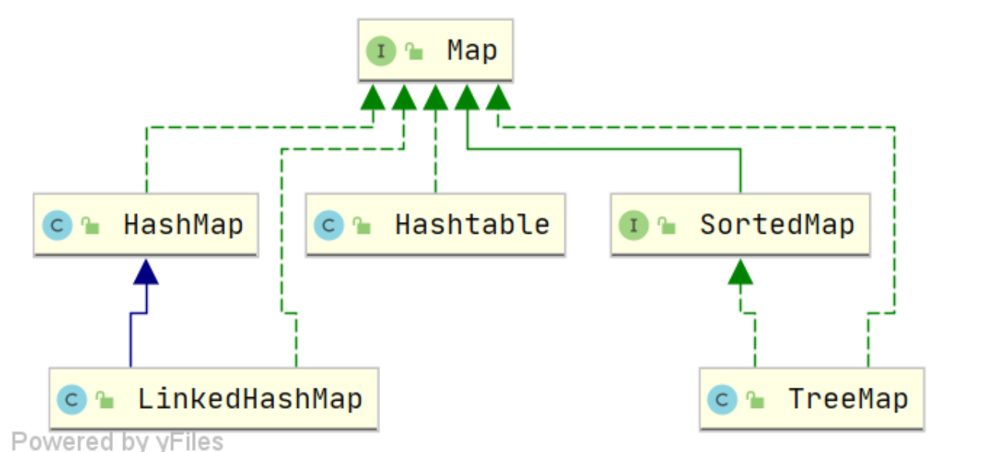

- (key, value): keys are unique, values could be repeated
- common methods

    | common method | description |
    | ------------- | ----------- |
    | put (K key, V value) | |
    | size () | |
    | clear () | |
    | isEmpty () | |
    | get (Object key) | |
    | remove (Object key) | |
    | containsKey (Object key) |  |
    | containsValue (Object value) | |
    | public Set<K> keySet () | |
    | Collections<V> values () | |
    | putAll (Map<? extends K, ? extends V> m) |  |


## 2.1 HashMap

### 2.1.0 Features

- Features
    - unordered
    - unrepeatable
    - unindex

- when key=null, refer to the first place in the hash table
- initial capacity (16 by default)
    - the initial capacity of the hash table
- load factor (0.75 by default)
    - the ratio of the number of key-value pairs that can be stored in the hash table to the size of the hash table before it is expanded
- unordered, i.e. the order of input and output not same
- "father" of HashSet
    - HashSet only uses the key of HashMap

### 2.1.1 Common methods

```java
// new instance
HashMap<String, String> stringHashMap = new HashMap<>();
// add --> put
stringHashMap.put("j", "jiang");
stringHashMap.put("l", "lin");
stringHashMap.put("c", "cool");
// read --> get
String value1 = stringHashMap.get("j");
// update --> put
stirngHashMap.put("c", "cold");
// delete --> remove
stringHashMap.remove("c");
// traversal
for (String key : stringHashMap.keySet()) {
  String value = stringHashMap.get(key);
  System.out.println(key + ": " + value);
}
```

### Principle (src)

#### Attributes of class

```java
public class HashMap<K,V> extends AbstractMap<K,V> implements Map<K,V>, Cloneable, Serializable {
    // serialized num
    private static final long serialVersionUID = 362498820763181265L; //TODO What is Serializable?
    // init capacity 16 by default
    static final int DEFAULT_INITIAL_CAPACITY = 1 << 4;
    // max. capacity
    static final int MAXIMUM_CAPACITY = 1 << 30;
    // load factor by default: 0.75
    static final float DEFAULT_LOAD_FACTOR = 0.75f;

    // when the number of the node of the bucket greater than TREEIFY_THRESHOLD (8) then turns to red-black tree
    static final int TREEIFY_THRESHOLD = 8;
    // 当桶(bucket)上的结点数小于等于这个值时树转链表
    static final int UNTREEIFY_THRESHOLD = 6;
    // 桶中结构转化为红黑树对应的table的最小容量
    //
    static final int MIN_TREEIFY_CAPACITY = 64;
    // 存储元素的数组，总是2的幂次倍
    // table is array to store element, what kind of element? Node<k,v> ==> double linked list
    transient Node<k,v>[] table; // table is array
    // 一个包含了映射中所有键值对的集合视图
    transient Set<map.entry<k,v>> entrySet;
    // 存放元素的个数，注意这个不等于数组的长度。
    transient int size;
    // 每次扩容和更改map结构的计数器
    transient int modCount;
    // > threshold, then need to enlarge capacity
    int threshold; // threshold = capacity * loadFactor

    final float loadFactor;
}
```

- loadFactor ([0, 1])
    - control the sparseness of the data stored in the array
    - ~1 ==> the more data (entries) stored in the array, the denser it will be
    - ~0 ==> the fewer ..., the sparser ...
    - loadFactor = 0.75 by default is good num
- threshold: when the size is greater than threshold, then need to enlarge the capacity

#### Data structure, store element

> data structure
> - before jdk8: array + linked list
> - after jdk8: array + linked list + red-black tree
> 
> we consider the case after jdk8

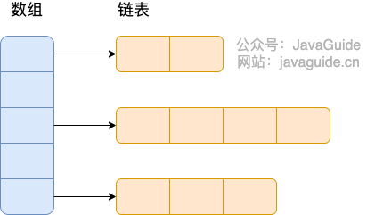  


- How to store elements in the HashMap (underlying view)? How to deal with hash collision?
    ```Java
    static final int hash(Object key) {
        int h;
        // if key == null then return 0, null can be used in HashMap, it is said that hashcode of null is 0
        // if key !== null, then:
        // key.hashCode(): gets the standard hashcode through hashCode()
        // h >>> 16: Unsigned right shift — moves the high 16 bits down to the lower 16 bits.
        // ^: Bitwise XOR — mixes the original hash with its shifted version.
        // h ^ (h >>> 16): hash spreading / hash mixing
        return (key == null) ? 0 : (h = key.hashCode()) ^ (h >>> 16); // return new hashcode of key
    }
    ```
    1. `key` === `hashCode()` === `hash()` ==> hash code of `key`
    2. (n-1) & hash ==> index in array (n is length of array)
    3. if the index i is already occupied by other element (this is hash collision), then to see if the two elements have same hash value and key
    4. if it's same then override, if not, store the new element in the linked list from this index position

- When will the linked list be turned to red-black tree?
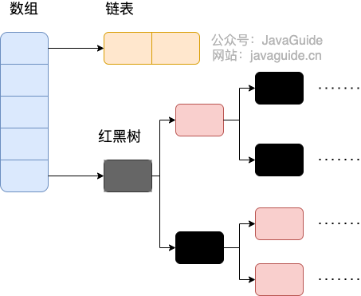  
    - the length of the linked table greater than 8 (by default) and the length of array is greater than 64
        - if the length of array is smaller than 64, then it will enlarge the capacity by double (28 ==> 56)
    - red-black tree is not efficient, so better not use it directly
    - source code   
        - the length of linked table greater than 8, then:
            ```java
            // traverse the linked table
            for (int binCount = 0; ; ++binCount) {
                // traverse until the last point of the linked table
                if ((e = p.next) == null) {
                    p.next = newNode(hash, key, value, null);
                    // the length of linked talble compare with TREEIFY_THRESHOLD（by default 8）
                    if (binCount >= TREEIFY_THRESHOLD - 1) // -1 for 1st
                        // red-black tree transfer method (see below)
                        treeifyBin(tab, hash);
                    break;
                }
                if (e.hash == hash &&
                    ((k = e.key) == key || (key != null && key.equals(k))))
                    break;
                p = e;
            }
            ```
        - `treeifyBin`: check the length of array if is greater than 64
            ```java
            // it is node stored in the array
            final void treeifyBin(Node<K,V>[] tab, int hash) {
                int n, index; 
                Node<K,V> e;
                // the length of array smaller than 64?
                if (tab == null || (n = tab.length) < MIN_TREEIFY_CAPACITY)
                    // if the length of array smaller than 64, then enlarge the capacity of array
                    resize();
                // if not, then transfer linked table to red-black tree 
                else if ((e = tab[index = (n - 1) & hash]) != null) {

                    TreeNode<K,V> hd = null, tl = null;
                    do {
                        TreeNode<K,V> p = replacementTreeNode(e, null);
                        if (tl == null)
                            hd = p;
                        else {
                            p.prev = tl;
                            tl.next = p;
                        }
                        tl = p;
                    } while ((e = e.next) != null);
                    if ((tab[index] = hd) != null)
                        hd.treeify(tab);
                }
            }
            ```
#### Constructor

```java
// 1. no parameter
public HashMap() {
    this.loadFactor = DEFAULT_LOAD_FACTOR; // all other fields defaulted
    }

// 2. with Map<> as parameter
public HashMap(Map<? extends K, ? extends V> m) {
    this.loadFactor = DEFAULT_LOAD_FACTOR;
    putMapEntries(m, false);//下面会分析到这个方法
}

// 3. user-defined init capacity as parameter
public HashMap(int initialCapacity) {
    this(initialCapacity, DEFAULT_LOAD_FACTOR);
}

// 4. user-defined capacity and loadFactor as parameter
public HashMap(int initialCapacity, float loadFactor) {
    if (initialCapacity < 0)
        throw new IllegalArgumentException("Illegal initial capacity: " + initialCapacity);
    if (initialCapacity > MAXIMUM_CAPACITY)
        initialCapacity = MAXIMUM_CAPACITY;
    if (loadFactor <= 0 || Float.isNaN(loadFactor))
        throw new IllegalArgumentException("Illegal load factor: " + loadFactor);
    this.loadFactor = loadFactor;
    // 初始容量暂时存放到 threshold ，在resize中再赋值给 newCap 进行table初始化
    this.threshold = tableSizeFor(initialCapacity);
}
```

#### `put()`

- `put()` invokes `putVal()` which can only be invoked by `put()`, not by user
- `putVal()`
    - position i of array has no element: put the new element
    - position i of array is occupied, compare the key of the new element and exist element
        - it's same ==> override
        - different ==> 

```java
public V put(K key, V value) {
    return putVal(hash(key), key, value, false, true);
}

// bucket: a place in array
// table is array where store Node<K,V> (double linked list)
// tab: a local variable, an array to store Node<k,V>
final V putVal(int hash, K key, V value, boolean onlyIfAbsent, boolean evict) {

    Node<K,V>[] tab; 
    Node<K,V> p; 
    int n, i;

    // table is not initialized or the length of it is 0, then we need to enlarge the capacity of it (array)
    // (tab = table) == null : table has not yet been initialized
    // (n = tab.length) == 0 : the length of table is 0 ==> no space to store
    if ((tab = table) == null || (n = tab.length) == 0)
        n = (tab = resize()).length; // what does `resize()`?

    // (n - 1) & hash: calculate the index in table (array) / which bucket
    // if this bucket (this position of array) is null/empty, then we put the new element in the bucket ==> create a new Node with the current new element (hash, key, value), because you have hash, key, value ... as the parameter instead of a Node
    // p ==> the current node who takes over this bucket (the one the new element wants to go) #TODO (HashMap)what is p?
    if ((p = tab[i = (n - 1) & hash]) == null)
        // how do you store a node in the array?
        tab[i] = newNode(hash, key, value, null);

    // if this position of array has been occupied (hash collision)
    else {
        Node<K,V> e; 
        K k;
        //快速判断第一个节点table[i]的key是否与插入的key一样，若相同就直接使用插入的值p替换掉旧的值e。
        // compare current node p and new element ==> their hash and key ==> to see if they are same
        // if they are same then override the current node with new 
        if (p.hash == hash && ((k = p.key) == key || (key != null && key.equals(k))))
            e = p; // ???
        // is p a node of red-black tree?
        else if (p instanceof TreeNode) // #TODO instanceof
            // put into the tree
            e = ((TreeNode<K,V>)p).putTreeVal(this, tab, hash, key, value);
        // not red-black node then is linked list node
        else {
            // 在链表最末插入结点
            for (int binCount = 0; ; ++binCount) {
                // 到达链表的尾部
                if ((e = p.next) == null) {
                    // 在尾部插入新结点
                    p.next = newNode(hash, key, value, null);
                    // 结点数量达到阈值(默认为 8 )，执行 treeifyBin 方法
                    // 这个方法会根据 HashMap 数组来决定是否转换为红黑树。
                    // 只有当数组长度大于或者等于 64 的情况下，才会执行转换红黑树操作，以减少搜索时间。否则，就是只是对数组扩容。
                    if (binCount >= TREEIFY_THRESHOLD - 1) // -1 for 1st
                        treeifyBin(tab, hash);
                    // 跳出循环
                    break;
                }
                // 判断链表中结点的key值与插入的元素的key值是否相等
                if (e.hash == hash &&
                    ((k = e.key) == key || (key != null && key.equals(k))))
                    // 相等，跳出循环
                    break;
                // 用于遍历桶中的链表，与前面的e = p.next组合，可以遍历链表
                p = e;
            }
        }
        // 表示在桶中找到key值、hash值与插入元素相等的结点
        if (e != null) {
            // 记录e的value
            V oldValue = e.value;
            // onlyIfAbsent为false或者旧值为null
            if (!onlyIfAbsent || oldValue == null)
                //用新值替换旧值
                e.value = value;
            // 访问后回调
            afterNodeAccess(e);
            // 返回旧值
            return oldValue;
        }
    }
    // 结构性修改
    ++modCount;
    // 实际大小大于阈值则扩容
    if (++size > threshold)
        resize();
    // 插入后回调
    afterNodeInsertion(evict);
    return null;
}
```
#### `resize()` #TODO (HashMap) how to resize?
```java
final Node<K,V>[] resize() {
    Node<K,V>[] oldTab = table; // 获取原来的数组 table
    int oldCap = (oldTab == null) ? 0 : oldTab.length; // 获取数组长度 oldCap
    int oldThr = threshold; // 获取阈值 oldThr
    int newCap, newThr = 0;
    if (oldCap > 0) { // 如果原来的数组 table 不为空
        if (oldCap >= MAXIMUM_CAPACITY) { // 超过最大值就不再扩充了，就只好随你碰撞去吧
            threshold = Integer.MAX_VALUE;
            return oldTab;
        }
        else if ((newCap = oldCap << 1) < MAXIMUM_CAPACITY && // 没超过最大值，就扩充为原来的2倍
                 oldCap >= DEFAULT_INITIAL_CAPACITY)
            newThr = oldThr << 1; // double threshold
    }
    else if (oldThr > 0) // initial capacity was placed in threshold
        newCap = oldThr;
    else { // zero initial threshold signifies using defaults
        newCap = DEFAULT_INITIAL_CAPACITY;
        newThr = (int)(DEFAULT_LOAD_FACTOR * DEFAULT_INITIAL_CAPACITY);
    }
    // 计算新的 resize 上限
    if (newThr == 0) {
        float ft = (float)newCap * loadFactor;
        newThr = (newCap < MAXIMUM_CAPACITY && ft < (float)MAXIMUM_CAPACITY ?
                  (int)ft : Integer.MAX_VALUE);
    }
    threshold = newThr; // 将新阈值赋值给成员变量 threshold
    @SuppressWarnings({"rawtypes","unchecked"})
        Node<K,V>[] newTab = (Node<K,V>[])new Node[newCap]; // 创建新数组 newTab
    table = newTab; // 将新数组 newTab 赋值给成员变量 table
    if (oldTab != null) { // 如果旧数组 oldTab 不为空
        for (int j = 0; j < oldCap; ++j) { // 遍历旧数组的每个元素
            Node<K,V> e;
            if ((e = oldTab[j]) != null) { // 如果该元素不为空
                oldTab[j] = null; // 将旧数组中该位置的元素置为 null，以便垃圾回收
                if (e.next == null) // 如果该元素没有冲突
                    newTab[e.hash & (newCap - 1)] = e; // 直接将该元素放入新数组
                else if (e instanceof TreeNode) // 如果该元素是树节点
                    ((TreeNode<K,V>)e).split(this, newTab, j, oldCap); // 将该树节点分裂成两个链表
                else { // 如果该元素是链表
                    Node<K,V> loHead = null, loTail = null; // 低位链表的头结点和尾结点
                    Node<K,V> hiHead = null, hiTail = null; // 高位链表的头结点和尾结点
                    Node<K,V> next;
                    do { // 遍历该链表
                        next = e.next;
                        if ((e.hash & oldCap) == 0) { // 如果该元素在低位链表中
                            if (loTail == null) // 如果低位链表还没有结点
                                loHead = e; // 将该元素作为低位链表的头结点
                            else
                                loTail.next = e; // 如果低位链表已经有结点，将该元素加入低位链表的尾部
                            loTail = e; // 更新低位链表的尾结点
                        }
                        else { // 如果该元素在高位链表中
                            if (hiTail == null) // 如果高位链表还没有结点
                                hiHead = e; // 将该元素作为高位链表的头结点
                            else
                                hiTail.next = e; // 如果高位链表已经有结点，将该元素加入高位链表的尾部
                            hiTail = e; // 更新高位链表的尾结点
                        }
                    } while ((e = next) != null); //
                    if (loTail != null) { // 如果低位链表不为空
                        loTail.next = null; // 将低位链表的尾结点指向 null，以便垃圾回收
                        newTab[j] = loHead; // 将低位链表作为新数组对应位置的元素
                    }
                    if (hiTail != null) { // 如果高位链表不为空
                        hiTail.next = null; // 将高位链表的尾结点指向 null，以便垃圾回收
                        newTab[j + oldCap] = hiHead; // 将高位链表作为新数组对应位置的元素
                    }
                }
            }
        }
    }
    return newTab; // 返回新数组
}
```


### Traversal

#### Iterator

1. Iterator EntrySet

```java
public class HashMapTest {
    public static void main(String[] args) {
        Map<Integer, String> map = new HashMap();
        map.put(1, "Java");
        map.put(2, "JDK");
        map.put(3, "Spring Framework");
        map.put(4, "MyBatis framework");
        // traversal
        Iterator<Map.Entry<Integer, String>> iterator = map.entrySet().iterator();
        while (iterator.hasNext()) {
            Map.Entry<Integer, String> entry = iterator.next();
            System.out.println(entry.getKey());
            System.out.println(entry.getValue());
        }
    }
}
```

2. Iterator KeySet

```java
public class HashMapTest {
    public static void main(String[] args) {
        Map<Integer, String> map = new HashMap();
        map.put(1, "Java");
        map.put(2, "JDK");
        map.put(3, "Spring Framework");
        map.put(4, "MyBatis framework");
        Iterator<Integer> iterator = map.keySet().iterator();
        while (iterator.hasNext()) {
            Integer key = iterator.next();
            System.out.println(key);
            System.out.println(map.get(key));
        }
    }
}
```

#### forEach

3. ForEach EntrySet

```java
public class HashMapTest {
    public static void main(String[] args) {
        Map<Integer, String> map = new HashMap();
        map.put(1, "Java");
        map.put(2, "JDK");
        map.put(3, "Spring Framework");
        map.put(4, "MyBatis framework");
        for (Map.Entry<Integer, String> entry : map.entrySet()) {
            System.out.println(entry.getKey());
            System.out.println(entry.getValue());
        }
    }
}
```

4. ForEach KeySet

```java
public class HashMapTest {
    public static void main(String[] args) {
        Map<Integer, String> map = new HashMap();
        map.put(1, "Java");
        map.put(2, "JDK");
        map.put(3, "Spring Framework");
        map.put(4, "MyBatis framework");
        // 遍历
        for (Integer key : map.keySet()) {
            System.out.println(key);
            System.out.println(map.get(key));
        }
    }
}
```

#### Lambda

5. Lambda

```java
public class HashMapTest {
    public static void main(String[] args) {
        Map<Integer, String> map = new HashMap();
        map.put(1, "Java");
        map.put(2, "JDK");
        map.put(3, "Spring Framework");
        map.put(4, "MyBatis framework");
        map.forEach((key, value) -> {
            System.out.println(key);
            System.out.println(value);
        });
    }
}
```

#### stream

6. stream API single thread
```java
public class HashMapTest {
    public static void main(String[] args) {
        Map<Integer, String> map = new HashMap();
        map.put(1, "Java");
        map.put(2, "JDK");
        map.put(3, "Spring Framework");
        map.put(4, "MyBatis framework");
        map.entrySet().stream().forEach((entry) -> {
            System.out.println(entry.getKey());
            System.out.println(entry.getValue());
        });
    }
}
```

7. stream API multiple threads

```java
public class HashMapTest {
    public static void main(String[] args) {
        Map<Integer, String> map = new HashMap();
        map.put(1, "Java");
        map.put(2, "JDK");
        map.put(3, "Spring Framework");
        map.put(4, "MyBatis framework");
        map.entrySet().parallelStream().forEach((entry) -> {
            System.out.println(entry.getKey());
            System.out.println(entry.getValue());
        });
    }
}
```

### HashMap vs. HashTable

| / | HashMap | HashTable |
|---|---|---|
| thread safety | no | yes |
| null key/value | yes | no |

- `HashTable` is basically obsolete, don't use it in your code
- thread safety
    - `HashMap` not
    - `HashTable` yes
    - `ConcurrentHashMap` is thread safety alternative for `HashMap`
- null key and null value
    - `HashMap` supports both
- capacity
    - HashMap
        - initial capacity is 16 if user doesn't give capacity
        - if user give initial capacity, it will always be enlarged to double times of what you gave
        
        ```java
        public HashMap(int initialCapacity, float loadFactor) {
            if (initialCapacity < 0)
                throw new IllegalArgumentException("Illegal initial capacity: " + initialCapacity);
            if (initialCapacity > MAXIMUM_CAPACITY)
                initialCapacity = MAXIMUM_CAPACITY;
            if (loadFactor <= 0 || Float.isNaN(loadFactor))
                throw new IllegalArgumentException("Illegal load factor: " + loadFactor);
            this.loadFactor = loadFactor;
            this.threshold = tableSizeFor(initialCapacity);
        }
        public HashMap(int initialCapacity) {
            this(initialCapacity, DEFAULT_LOAD_FACTOR);
        }

        /**
        * Returns a power of two size for the given target capacity.
        */
        static final int tableSizeFor(int cap) {
            int n = cap - 1;
            n |= n >>> 1;
            n |= n >>> 2;
            n |= n >>> 4;
            n |= n >>> 8;
            n |= n >>> 16;
            return (n < 0) ? 1 : (n >= MAXIMUM_CAPACITY) ? MAXIMUM_CAPACITY : n + 1;
        }
        ```
        - enlarge capacity: always double
    - HashTable

- data structure
- hash function

### HashMap vs. HashSet
- `HashSet` is implemented through `HashMap`
- 


### How does HashMap ensure that unique key?

- hashCode() and equals()

### what if the self-defined object is stored in key?

- HashMap will get the address of the instance to convey it to hash code
- even when the instances have the same content but as their address is different, HashMap will consider them as the same
- in order to avoid that we can override hashCode() and equals() methods in the object class

```java
@Override
public boolean equals(Object o) {
    if (this == o) return true;
    if (o == null || getClass() != o.getClass()) return false;
    Card card = (Card) o; 
    return size == card.size && Objects.equals(number, card.number) && Objects.equals(color, card.color);
}

@Override
public int hashCode() {
    return Objects.hash(number, color, size);
}
```
### Why is the length of a HashMap a power of 2?

### Why is HashMap not thread safe?

```java
public V put(K key, V value) {
    return putVal(hash(key), key, value, false, true);
}

final V putVal(int hash, K key, V value, boolean onlyIfAbsent,
boolean evict) {
    // ...
    // hash collision?
    // (n - 1) & hash 确定元素存放在哪个桶中，桶为空，新生成结点放入桶中(此时，这个结点是放在数组中)
    if ((p = tab[i = (n - 1) & hash]) == null)
        tab[i] = newNode(hash, key, value, null);
    // 桶中已经存在元素（处理hash冲突）
    else {
    // ...
}
```

## 2.2 ConcurrentHashMap

- data structure
    - before jdk8: segment array + linked table
        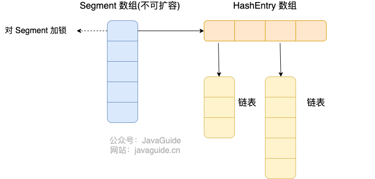  
    - after jdk8: same with HashMap, which array + linked table + red-black tree
        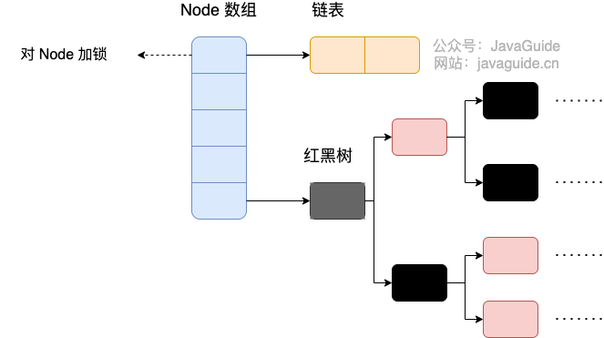  

- How to achieve thread safety?
    - Node array + linked table + red-black tree
    - synchronized + CAS
    - what's the benefit? Java 8 中，锁粒度更细，synchronized 只锁定当前链表或红黑二叉树的首节点，这样只要 hash 不冲突，就不会产生并发，就不会影响其他 Node 的读写，效率大幅提升。

- Why can't ConcurrentHashMap have null key and null value?

## 2.2 LinkedHashMap

- Features
    - ordered
    - unrepeatable
    - unindex
- child class of HashMap
- keep the order of adding of elements
- put("j", "jiang"), ("l", "lin"), ("l", "cool")
- output: ("j", "jiang"), ("l", "lin"), ("l", "cool") --> in HashMap could be something else

## 2.3 TreeMap

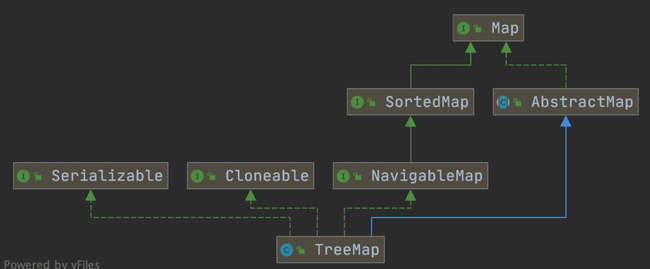  
- TreeMap implements NavigableMap
    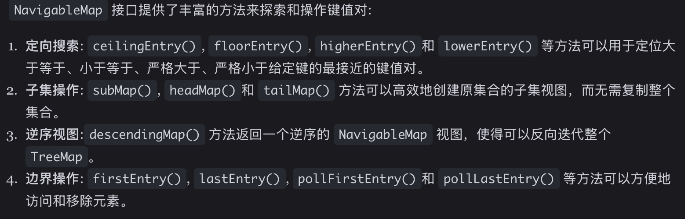  
- TreeMap implements SortedMap interface
    - which can automatically sort keys in their natural order or in the specified comparator order, and guarantee the order of their elements. Internally, it uses a red-black tree to implement sorting and lookup of keys.

    ```java
    public class Person {
        private Integer age;

        public Person(Integer age) {
            this.age = age;
        }

        public Integer getAge() {
            return age;
        }

        // alias class ==> Comparator
        public static void main(String[] args) {
            TreeMap<Person, String> treeMap = new TreeMap<>(new Comparator<Person>() {
                @Override
                public int compare(Person person1, Person person2) {
                    int num = person1.getAge() - person2.getAge();
                    return Integer.compare(num, 0);
                }
            });
            treeMap.put(new Person(3), "person1");
            treeMap.put(new Person(18), "person2");
            treeMap.put(new Person(35), "person3");
            treeMap.put(new Person(16), "person4");
            treeMap.entrySet().stream().forEach(personStringEntry -> {
                System.out.println(personStringEntry.getValue());
            });
        }
    }

    // or with lambda
    TreeMap<Person, String> treeMap = new TreeMap<>((person1, person2) -> {
        int num = person1.getAge() - person2.getAge();
        return Integer.compare(num, 0);
    });
    ```

- Features
    - ordered according to key (increase by default)
    - unrepeatable
    - no index

## 2.4 Comparable and Comparator

## 2.5 Iterator and Iterable


# Attention!

## 3.1 Is Collection empty?

## 3.2 Collection to Map?

## 3.3 Traversal

## 3.4 Get rid of duplication

## 3.5 Collection to Array

## 3.6 Array to Collection