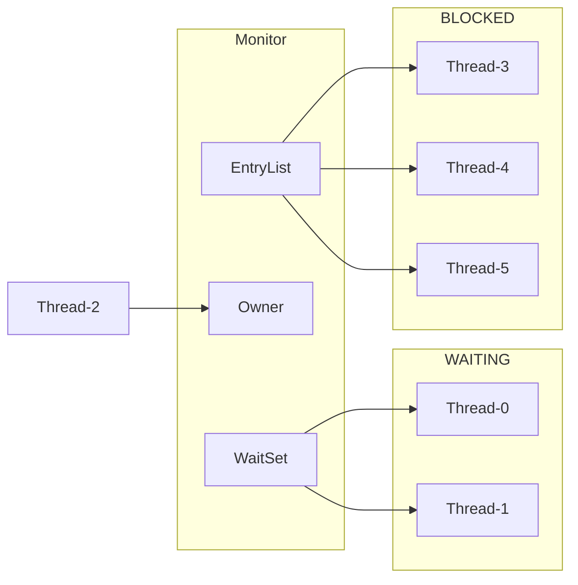
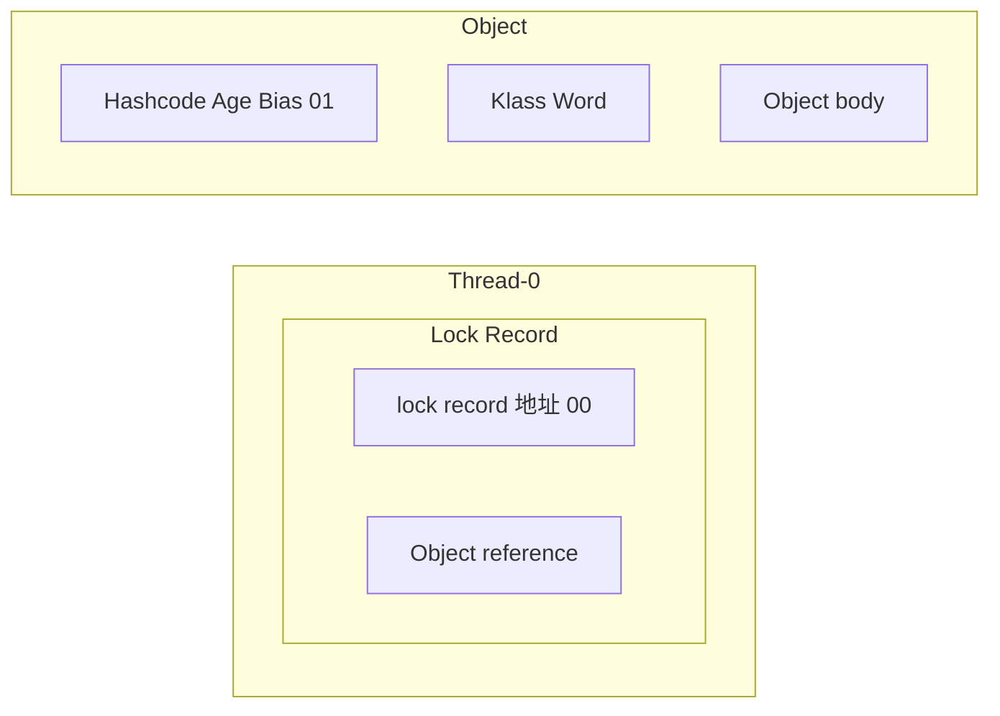

# Computer Architectur

> **Instructions Reordering**
>
> **什么是指令重排序** 简单来说就是系统在执行代码的时候并不一定是按照你写的代码的顺序依次执行。
>
> 常见的指令重排序有下面 2 种情况：
>
> - **编译器优化重排**：编译器（包括 JVM、JIT 编译器等）在不改变单线程程序语义的前提下，重新安排语句的执行顺序。
> - **指令并行重排**：现代处理器采用了指令级并行技术(Instruction-Level Parallelism，ILP)来将多条指令重叠执行。如果不存在数据依赖性，处理器可以改变语句对应机器指令的执行顺序。
>
> ---
>
> 著作权归 JavaGuide(javaguide.cn)所有 基于 MIT 协议 原文链接：https://javaguide.cn/java/concurrent/jmm.html
>
> - But sometimes we don't want Instructions Reordering, what can we do?
>   - keyword: `volatile`
>   - `loadFence()`, `storeFence()`, `fullFence()` from Unsafe Class

- memory model of computer
- Instructions Reordering

--> https://github.com/CoderLeixiaoshuai/java-eight-part/blob/master/docs/java/juc/面试官：说说什么是Java内存模型？.md

--> https://javaguide.cn/java/concurrent/jmm.html#从-cpu-缓存模型说起

# Basic Principles

- Atomicity (alle oder keine): One operation or multiple operations, where either all operations are performed and are not interrupted by any factor, or none of them are performed / entweder alle Vorgänge durchgeführt werden oder keine
  - how to achieve?
    - `synchronized` : guarantee only one thread has access to the code at any time
    - different Locks: guarantee only one thread has access to the code at any time
    - atomic class: CAS (compare and swap), `volatile`, `final`
- Visibility: The JMM outlines when **changes** to shared variables in one thread become **visible** to other threads
  - how to achieve?
    - `synchronized`, `volatile`, various Locks
    -
- Ordering: The JMM permits certain **optimizations** and **reorderings** by the compiler/JVM/runtime _as long as_ the end result is **semantically consistent**
  - because of instruction reordering

# happens-before Principle

> happens-before 原则表达的意义其实并不是一个操作发生在另外一个操作的前面，虽然这从程序员的角度上来说也并无大碍。更准确地来说，它更想表达的意义是前一个操作的结果对于后一个操作是可见的，无论这两个操作是否在同一个线程里。
>
> ---
>
> 著作权归 JavaGuide(javaguide.cn)所有 基于 MIT 协议 原文链接：https://javaguide.cn/java/concurrent/jmm.html

> **为什么需要 happens-before 原则？** happens-before 原则的诞生是为了程序员和编译器、处理器之间的平衡。程序员追求的是易于理解和编程的强内存模型，遵守既定规则编码即可。编译器和处理器追求的是较少约束的弱内存模型，让它们尽己所能地去优化性能，让性能最大化。happens-before 原则的设计思想其实非常简单：
>
> - 为了对编译器和处理器的约束尽可能少，只要不改变程序的执行结果（单线程程序和正确执行的多线程程序），编译器和处理器怎么进行重排序优化都行。
> - 对于会改变程序执行结果的重排序，JMM 要求编译器和处理器必须禁止这种重排序。
>
> ---
>
> 著作权归 JavaGuide(javaguide.cn)所有 基于 MIT 协议 原文链接：https://javaguide.cn/java/concurrent/jmm.html

medium: https://medium.com/@gathilaharism/happens-before-rules-specified-in-java-memory-model-734ab400170f#:~:text=In%20Java%2C%20the%20Java%20Memory,to%20B%2C%20and%20vice%20versa.

# JMM (Java Memory Model)


- Centeral question: How and when does a write in one thread become visible to a read in another thread?
- How to safely perform operations between main memory and working memory in a multithreaded environment
- JMM is a specification and it defines things:
  - all variables are stored in Main Memory / der Hauptspeicher
  - each thread has a private Local Memory, which stores a copy of the shared variables that the thread reads/writes to
  - all thread operations on variables must be performed in Local Memory, cannot read or write directly to Main Memory
  - different threads can't directly access each other's variables in local memory

# Process vs. Thread

|     | Process                                                                                                                         | Thread                                                                                                    |
| --- | ------------------------------------------------------------------------------------------------------------------------------- | --------------------------------------------------------------------------------------------------------- |
|     | basic unit of the operating system for allocating resources / Grundeinheit des Betriebssystems für die Zuweisung von Ressourcen | basic unit of the operating system for scheduling / Grundeinheit des Betriebssystems für die Zeitplanung  |
|     | independent memory space / unabhängiger Speicherbereich                                                                         | share the memory space of the process / teilen sich den Speicherbereich des Prozesses mit anderen Threads |
|     | complex communication between processes                                                                                         | simple ... between threads                                                                                |
|     | independent from other processes / unabhängig voneinander                                                                       | interdependent with other threads / voneinander abhängig                                                  |

Program 程序：为了完成特定任务、用某种语言编写的一组指令的集合。即一段静态的代码，静态对象。

Process 进程：

Thread 线程：进程可以细化为线程，它是**一个程序内部的一条执行路径**

1. 若一个进程同一时间并行执行多个线程，就是支持多线程的
2. 线程作为调度和执行的单位，每个线程拥有独立的运行栈和程序计数器（pc），线程切换的开销小
3. 一个进程中的多个线程共享相同的内存单元/内存地址空间
   （去看一下内存区域的分配：方法区，虚拟机栈，本地方法栈，堆，程序计数器）

一个 Java 应用程序 java.exe, 其实至少有三个线程：main()主线程，gc()垃圾回收线程，异常处理线程

# Thread


## Create Multi-Threads

### method 1: inherit from Thread class

- new child class of Thread class -> override `run()` -> new instance of the child class -> start thread with `start()`

#### method 2: implement Runnable interface

1. 创建一个实现了 Runnable 接口的类
2. 实现类去实现 Runnable 中的抽象方法：run( )
3. 创建实现类的对象
4. 将此对象作为参数传递到 Thread 类的构造器中，创建 Thread 类的对象
5. 通过 Thread 类的对象调用 start( )

### method 3: implement Callable interface

### Thread class vs. Runnable interface

优先选择：实现 Runnable 接口的方式

1. 实现的方式没有类的单继承性的局限性 (这也是借口出现的原因，就是为了打破类的单继承性的限制)
2. 实现的方式更适合来处理多个线程有共享数据的情况

联系：Thread 类也实现了 Runnable 接口

相同点：两种方法都需要重写 run( ), 将创建线程要执行的逻辑声明在 run( )中

## Thread 中的常用方法

1. start( ): 启动当前线程；调用当前线程的 run( )
2. run( ):
3. currentThread( ): 静态方法，返回执行当前代码的线程
4. getName( ): 获取当前线程的名字
5. setName( ): 设置当前线程的名字
6. yield( ): 释放当前 cpu 的执行权
7. join( ): 在线程 a 中调用线程 b 的 join( ), 此时线程 a 就进入阻塞状态，直到线程 b 完全执行完以后，线程 a 才结束阻塞状态
8. sleep(long millitime): 让当前线程“睡眠”指定的 millitime 毫秒。在指定的 millitime 毫秒时间内，当前线程是阻塞状态
9. isAlive( ): 判断当前线程是否存活
10. setDaemon()

## Life-Cycle of Thread


## States of Thread

> https://javabetter.cn/thread/thread-state-and-method.html


- NEW

  - Thread has been "newed" <== `new Thread()`
  - but not yet `start()` ==> has not connected with OS
  - Can we invoke `start()` repeatedly? and Can we invoke `start()` again when the thrad is in the state of "TERMINATED"?

- RUNNABLE: it implies two states

  - a thread is executing in the JVM or
  - it may be waiting for other resources from the OS such as processor

- BLOCKED

  - is waiting for the releasing of the lock
  -

- WAITING

  - key point: must be other threads to wake you up from the "WAITING" state

- TIME_WAITING
- TERMINATED

## Context Switching

- Thread Context Switch is a process of switching the working from one thread to another. The computer CPU stores the state of current thread, so that it can be retured later. Next it switches to the next thread, picks it where it was left before, and continuous to start working. / die Arbeit von einem Thread zu einem anderen umgeschaltet ist, den Zustand des aktuellen Thread speichern und dann später wiederherstellt werden kann

# Thread Safety

- Synchronization
- Atomic Wrapper classes
- locks from java.util.concurrent.locks
- thread safe collection classes
- volatile keyword

# Race Condition & Critical Section

- Race Condition: when multi-threads access shared data at the same time, and the final result depends on the timing of their execution
- Critical Section: a part of code that accesses shared resources that must not be concurrently modified by multiple threads

# Keyword: `volatile`

- declares the variable is shared and unstable, each time when the variable is used, it will be read from Main Memory / gemeinsam genutzt wird und instabil, wenn verwendet wird, wird aus dem Hauptspeicher gelesen
- Is found also in C, its original meaning was to disable CPU cache
- gurantee only visibility, not atomicity (`synchronized` gurantee both)
- prevent instructions reordering

# keywords `synchronized`

> 在 Java 6 之后， `synchronized` 引入了大量的优化如自旋锁、适应性自旋锁、锁消除、锁粗化、偏向锁、轻量级锁等技术来减少锁操作的开销，这些优化让 `synchronized` 锁的效率提升了很多（JDK18 中，偏向锁已经被彻底废弃，前面已经提到过了）
>
> ---
>
> 著作权归 JavaGuide(javaguide.cn)所有 基于 MIT 协议 原文链接：https://javaguide.cn/java/concurrent/java-concurrent-questions-02.html

## 4 kinds of lock

- 无锁
- 轻量级锁 lightweighted lock
- Biased lock
- 重量级锁 heavyweighted lock

## 锁膨胀

## Java object in JVM

### Object header

<table border ="1">
	<tr>
		<th colspan="2" style = "text-align:center">Object Header (64 bits)</th>
	</tr>
	<tr>
		<th> Mark Word (32 bits) </th>
		<th> Klass Word (32 bits) </th>
	</tr>
</table>

### Mark Word

#### general

<table border="1" style="border-collapse: collapse; text-align:center;">
  <tr>
    <th colspan="5">Mark Work (32 bits)</th>
    <th> State </th>
  </tr>
  <tr>
    <th colspan="2">hashcode: 25 bits</th>
    <th>age: 4</th2>
    <th>biased_lock: 0</th>
    <th>01</th>
    <th>Normal</th>
  </tr>
  <tr>
    <th>hashcode: 23 bits</th>
    <th>epoch:2</th>
    <th>age: 4</th>
    <th>biased_lock: 1</th>
    <th>01</th>
    <th>Biased</th>
  </tr>
  <tr>
    <th colspan="4">ptr_to_lock_record:30</th>
    <th>00</th>
    <th>Lightweight Locked</th>
  </tr>
  <tr>
    <th colspan="4">ptr_to_heavyweight_monitor:30</th>
    <th>10</th>
    <th>Heavyweight Locked</th>
  </tr>
  <tr>
    <th colspan="4"></th>
    <th>11</th>
    <th>Marked for GC</th>
  </tr>
</table>

#### in detail

<table border="1" cellspacing="0" cellpadding="6" style="border-collapse: collapse; text-align: center;">
  <tr style="background-color: #;">
    <th rowspan="2">lock state</th>
    <th colspan="2">56bit</th>
    <th>1bit</th>
    <th>4bit</th>
    <th>1bit<br>(biased lock?)</th>
    <th>2bit<br>(lock flag)</th>
  </tr>
  <tr style="background-color:;">
    <td>25bit</td>
    <td>31bit</td>
    <td></td>
    <td></td>
    <td></td>
    <td></td>
  </tr> <tr style="background-color:;">
    <td>no lock</td>
    <td>unused</td>
    <td>对象 hashCode</td>
    <td>Cms_free</td>
    <td>对象分代年龄</td>
    <td>0</td>
    <td>01</td>
  </tr> <tr style="background-color:;">
    <td>biased lock</td>
    <td>threadId(54bit)</td>
    <td>Epoch(2bit)</td>
    <td>Cms_free</td>
    <td>对象分代年龄</td>
    <td>1</td>
    <td>01</td>
  </tr> <tr style="background-color:;">
    <td>lightweighted lock</td>
    <td colspan="5">指向栈中锁的记录的指针</td>
    <td>00</td>
  </tr><tr style="background-color:;">
    <td>heavyweighted lock</td>
    <td colspan="5">pointer to heavyweighted lock</td>
    <td>10</td>
  </tr><tr style="background-color:;">
    <td>GC flag</td>
    <td colspan="6">empty</td>
  </tr>
</table>

## Monitor (OS)



- process
  - Owner in Monitor is null from the beginning
  - When Thread-2 execute `synchronized(obj)`, it will get owner from monitor ==> there is only one owner in monitor
  - during Thread-2 occupies the ownership of monitor other threads will be sent to EntryList when they also want to execute `synchronized(obj)` and will be set to state "BLOCKED"
  - after Thread-2 finished its task it will wake the threads in EntryList
  - In WaitList (Thread-0, Thread-1) are those threads that owned lock before but are not qualified to enter into the state "WAITING" ==> wait-notify
  - `synchronized` has to lock the same object in this case, so that we can get the result from above

## Principle of monitor

```java
static final Object lock = new Object();
static int counter = 0;

public static void main (String [] args) {
  synchronized (lock) {
    counter++;
  }
}
```

```java
// access flags 0x9
public static main([Ljava/lang/String;)V
  TRYCATCHBLOCK L0 L1 L2 null
  TRYCATCHBLOCK L2 L3 L2 null
  L4
  LINENUMBER 8 L4
  GETSTATIC com/concurrency/MonitorTets1.lock : Ljava/lang/Object;
  DUP
  ASTORE 1
  MONITORENTER // -> monitor
  L0
  LINENUMBER 9 L0
  GETSTATIC com/concurrency/MonitorTets1.counter : I
  ICONST_1
  IADD
  PUTSTATIC com/concurrency/MonitorTets1.counter : I
  L5
  LINENUMBER 10 L5
  ALOAD 1
  MONITOREXIT // --> monitor
  L1
  GOTO L6
  L2
  FRAME FULL [[Ljava/lang/String; java/lang/Object] [java/lang/Throwable]
  ASTORE 2
  ALOAD 1
  MONITOREXIT
  L3
  ALOAD 2
  ATHROW
  L6
  LINENUMBER 11 L6
  FRAME CHOP 1
  RETURN
  L7
  LOCALVARIABLE args [Ljava/lang/String; L4 L7 0
  MAXSTACK = 2
  MAXLOCALS = 3
```

## Lightweight Locked

### scenario

```java
static final Object obj = new Object();
public static void method1() {
  synchronized(obj) { // method1 and method2 lock the same object
    // synchronized block A
    method2();
  }
}
public static void method2() {
  synchronized(obj) { // method1 and method2 lock the same object
    // synchronized block B
  }
}
```

- a object is visited by multiple threads, but they visit object at different time
- which means there is no compete
- Lightweight Locked is transparent for user, still use `synchronized`

### process with chart

1. create Lock Record object - every thread's stack frame will contain one Lock Record - Mark Word of the object will be stored in Lord Record
   

2. when method1 is executed

   - object references in Lock Record will point to Lock object
   - lock record address in Lock Record will exchange with Mark Word in Object through CAS
   - 01: normal or biased locked
   - 00: lightweight locked
   - 

3. if CAS exchange successful

   - 

4. if could be that CAS failed (two cases)

   - case 1: other thread has occupied the lightweight locked of this object, then it means there is complete and it will enter into "锁膨胀"
   - case 2: if this thread execute `synchronized` again ("锁重入"), then another new Lock Record will be added, so you can count times of "锁重入"
     - 

5. unlock

- case 1: there is lock record with value null ==> "锁重入" ==> reset lock record and count of "锁重入" - 1
- case 2: lock record without value null ==> reset Mark Word of object through CAS, exchange back
  - this could also fail ==> "锁膨胀" or upgrade to heavyweight locked

<!-- <div align="center">



</div> -->

## 锁膨胀 (lock inflation)

- there is another thread want to have lightweight lock, but it fails because lock record has been recorded with 00
  - 
- it enters into lock inflation process
  - Object will get Monitor lock (?) and let Object point to address of heavyweight lock
  - Thread-1 will be added into EntryList of Monitor and enter into state "BLOCKED"
  - 
- When Thread-0 wants unlock, it will fail, because Mark Word has been occupied by the address of monitor
- then it will enter into the process of unlock of heavyweight lock, which is
  - find monitor object by the address of monitor
  - set Owner to null
  - wake up the BLOCKED thread in EntryList

## Spin Optimization for Heavyweight Locks

To improve the performance of heavyweight locks by allowing threads to spin (busy-wait) for a short period instead of immediately getting BLOCKED when a lock is not available.

- spin success
  
- spin fails
  

## Biased Lock

> removed since Java 15
> so it's maybe not that important for now

```java
static final Object obj = new Object();
public static void m1() {
  synchronized(obj) {
    // Block A
    m2();
  }
}
public static void m2() {
  synchronized(obj) {
    // Block B
    m3();
  }
}
public static void m3() {
  synchronized(obj) {
    // Block C
  }
}
```

- the same thread want to get lock (lightweight lock), because there is no compete with other threads, but this thread has to ask for CAS execution every time, it wastes performance
- Improvement in Java 6: put ID of this thread into Mark Word of the object. After that when there is no compete, this lock object should belong to this thread, so no more CAS exchange request

# wait & notify


- Threads in BLOCKED
  - haven't got lock, is in EntryList
- Threads in WAITING
  - haven't got lock once, but because of some reason can't continue to execute, in order to save time, so let other threads use lock first, they enter into WAITING state. They are in WaitSet
- Both BLOCKED and WAITING are in "blocked" state ==> don't occupy time-slicing
- Threads in WAITING will be waked up when
  - Thread with owner of the lock invoke `notify()` or `notifyAll()``
  - but WAITING threads will not directly become the owner of the lock
  - they will enter into the EntryList and compete with other threads there