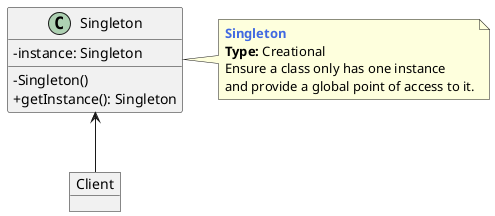
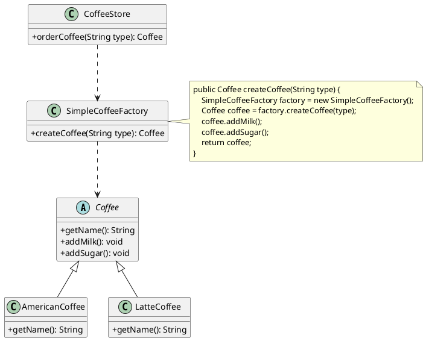
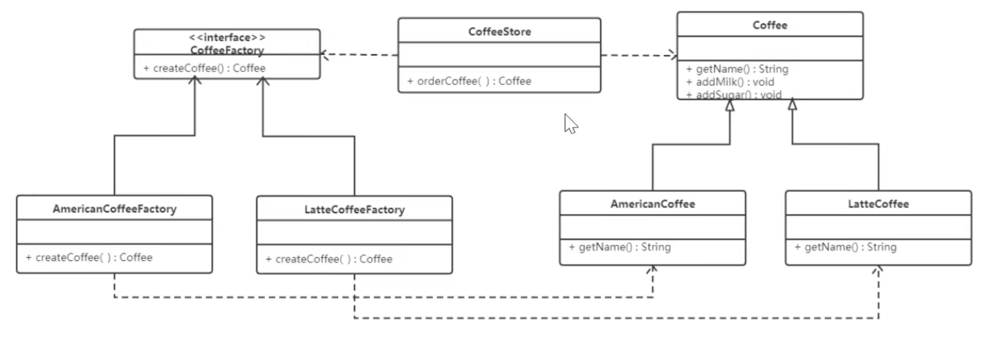
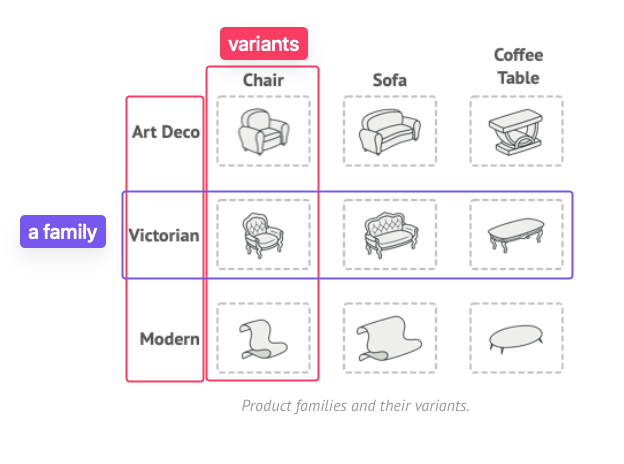
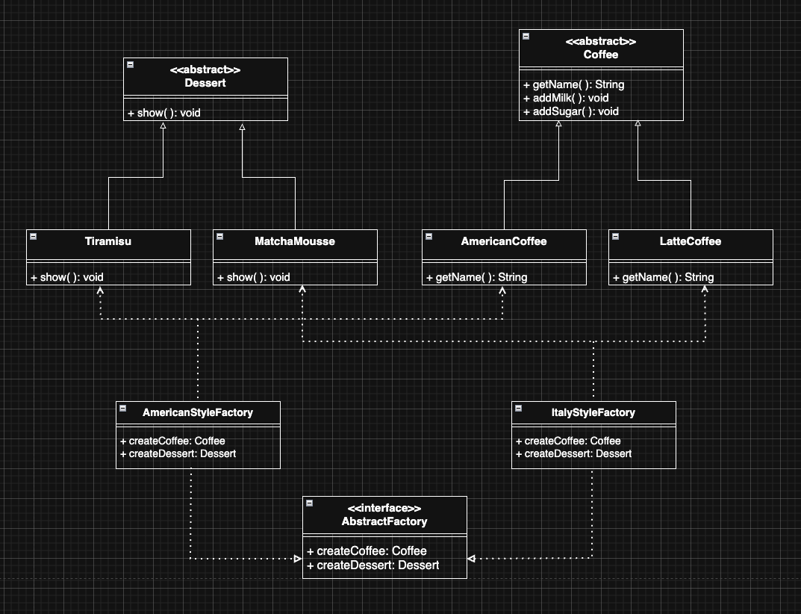

# Software Design Principles (SOLID)

## Open/closed principle

- open for expansion and close for editing


# 1. Creational Design Pattern

## 1.1 Singleton



### Features

- This class only does one thing ==> craete it's own instance
- It ensures that only one instance of this class will be created
- except itself, no one can instantiate this class
- It provides access to public and let them visit this unique instance of the class

### Implementation

#### instantiate when class loaded

- static member variable

- static code block

- enum singleton
    - very good Singleton design if you don't think about the storage waste
    ```java
    public enum Singleton {
        INSTANCE;
    }
    ```

#### instantiate when first time the class

- double check singleton

- static inner class

### How to destroy the Singleton?

==> skip

> [resource: heima_29_32](https://www.bilibili.com/video/BV1Np4y1z7BU?spm_id_from=333.788.player.switch&vd_source=5700f6f960dc64a5c17cbedf10fb3a37&p=29)

#### Serialization

- problem


- solution


#### Reflect

### Example of singleton in project

- RunTime src: static member variable
    ```java
    public class Runtime {
        // 2. private static member variable
        private static Runtime currentRuntime = new Runtime();
        // 3. public access to get instance
        public static Runtime getRuntime() {
            return currentRuntime;
        }
        /** Don't let anyone else instantiate this class */
        // 1. private constructor
        private Runtime() {}
    ```
- RunTime test

## 1.* Simple Factory



### Implementation

```java
// Coffee
public class Coffee {
    public abstract String getName();
    public String addMilk(){System.out.println("add milk");}
    public String addSugar(){System.out.println("add sugar");}
}
// LatteCoffee
public class LatteCoffee extends Coffee {
    public String getName() {
        System.out.println("latte coffee");
    }
}
// AmericanCoffee
public class AmericanCoffee extends Coffee {
    public String getName() {
        System.out.println("american coffee");
    }
}
// CoffeeStore
// Coffee Store only do two things: create coffee with the help of factory and add extra milk and sugar
public class CoffeeStore {
    public Coffee orderCoffee (String type) {
        Coffee coffee = null;
        SimpleCoffeeFactory simpleCoffeeFactory = new SimpleCoffeeFactory();
        coffee =simpleCoffeeFactory.createCoffee(type)
        coffee.addMilk();
        coffee.addSugar();
        return coffee;
    }
}
// SimpleCoffeeFactory: create coffee instance
public class SimpleCoffeeFactory {
    // public static Coffee createCoffee(String type)
    // ==> SimpleCoffeeFactory.createCoffee("latte");
    public Coffee createCoffee(String type) {
        Coffee coffee = null;
        if ("american".equals(type)) {
            coffee = new AmericanCoffee();
        } else if ("latte".equals(type)) {
            coffee = new LatteCoffee();
        } else {
            throw new RuntimeException("no such a coffee!");
        }
        return coffee;
    }
}
```
- Abstract product (Coffee): defines the specification of the product and describes the main features and functions of the product
- Concrete product (LatteCoffee, AmericanCoffee): implement abstract product and is created by concrete factory

## 1.2 Factory Method

  

- when you need a new kind of coffee, you don't have to edit the original code, you only need to add new subclass of coffee and new implementation class of CoffeeFactory interface
- 

## 1.3 Abstract Factory

  

- family - 产品族
- variant - 产品等级

  

## 1.4 Prototype

## 1.5 Builder

# 2. Structural Patterns

## 2.1 Proxy

### 2.1.1 Static Proxy

### 2.1.2 Dynamic Proxy
