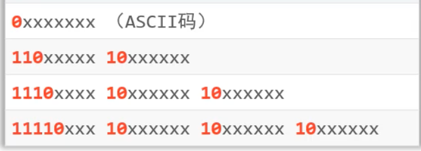
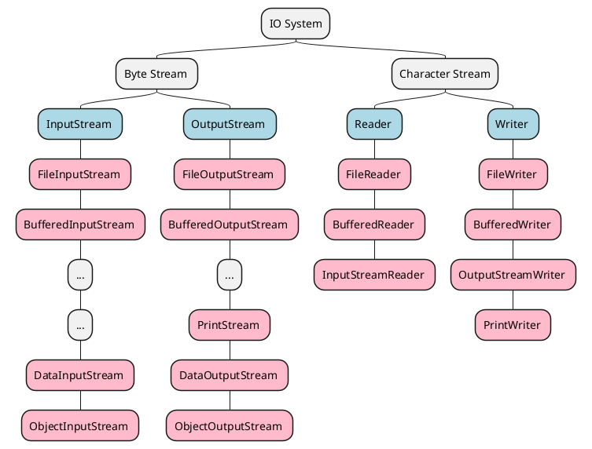
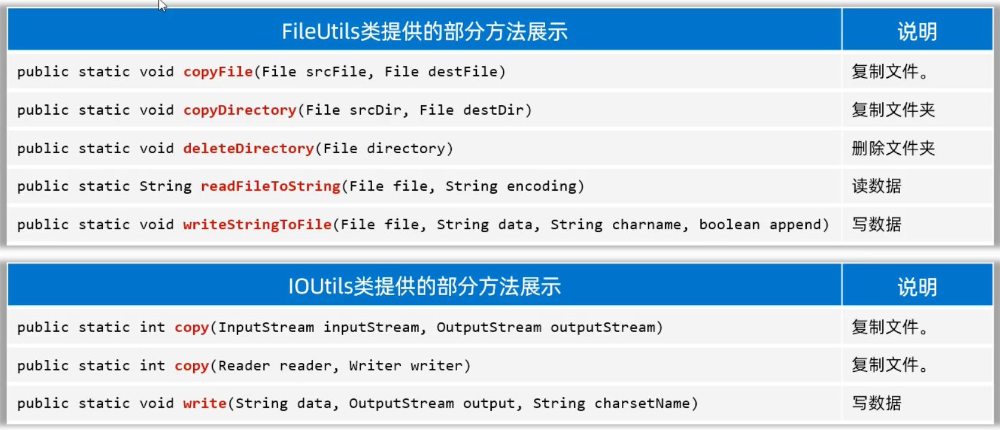

<!-- @import "[TOC]" {cmd="toc" depthFrom=1 depthTo=6 orderedList=false} -->

<!-- code_chunk_output -->

- [File](#file)
  - [new File object](#new-file-object)
  - [common method](#common-method)
    - [check file / directory / get info](#check-file--directory--get-info)
    - [create / delete](#create--delete)
    - [traverse directory](#traverse-directory)
- [Character set](#character-set)
  - [ASCII](#ascii)
  - [GBK](#gbk)
  - [Unicode](#unicode)
  - [Encoding operation of the character in Java](#encoding-operation-of-the-character-in-java)
- [IO](#io)
  - [IO System](#io-system)
  - [InputStream](#inputstream)
    - [FileInputStream is a implement class of InputStream](#fileinputstream-is-a-implement-class-of-inputstream)
    - [`public int read()`](#public-int-read)
    - [`public int read(byte[] buffer)`](#public-int-readbyte-buffer)
    - [read all bytes](#read-all-bytes)
      - [same size buffer with the file](#same-size-buffer-with-the-file)
      - [readAllBytes() ???](#readallbytes-)
  - [OutputStream](#outputstream)
  - [InputStream and OutputStream for copy](#inputstream-and-outputstream-for-copy)
  - [release the source properly](#release-the-source-properly)
    - [try-catch-finally](#try-catch-finally)
    - [try-with-resource](#try-with-resource)
  - [Reader](#reader)
  - [Writer](#writer)
  - [Buffered Stream](#buffered-stream)
    - [BufferedInputStream / BufferedOutputStream](#bufferedinputstream--bufferedoutputstream)
    - [BufferedReader / BufferedWriter](#bufferedreader--bufferedwriter)
  - [InputStreamReader](#inputstreamreader)
  - [OutputStreamWriter](#outputstreamwriter)
  - [PrintStream/PrintWriter](#printstreamprintwriter)
    - [PrintStream](#printstream)
    - [PrintWriter](#printwriter)
    - [System.out.println("...") redirection](#systemoutprintln-redirection)
  - [Data Stream](#data-stream)
    - [DataOutputStream](#dataoutputstream)
  - [Serializable Stream](#serializable-stream)
- [IO Framework](#io-framework)
  - [commons-io](#commons-io)

<!-- /code_chunk_output -->


# File

## new File object

## common method

### check file / directory / get info

| method | description |
| --- | --- |
| public boolean exisits() | |
| public boolean isFile() | |
| public boolean isDirectory() | |
| public String getName() | |
| public long length() | get the size of file/directory in bytes (pay attention to directory!)|
| public long lastModified() | |
| public String getPath() | get the path when the file object was created (absolute or relative)|
| public String getAbsolutePath() | get absolute path no matter absolute or relative path was used for creating file object |

- `lastModified()`
    ```java
    long time = f.lastModified();
    SimpleDateFormat sdf = new SimpleDateFormat("yyyy/MM/dd HH:mm:ss")
    System.out.println(sdf.format(time));
    ```

### create / delete

| method | description |
| --- | --- |
| public boolean createNewFile() | create an empty file |
| public boolean mkdir() | create only one layer directory|
| public boolean mkdirs() | create multi-layer directory |
| public boolean delete() | delete file and empty directory (no non-empty directory for security reason), will not get into trash bin after deleting|

### traverse directory

| method | description |
| --- | --- |
| public String[] list() | get the names of the level one directory under the current directory |
| public File[] listFiles() | get the objects of the level one directory under the current directory |

- `f.listFiles()`
    - when will return `null`?
        - f not exists or directory not exists
        - no access to f

# Character set

## ASCII

- ASCII: American Standard Code for Information Interchange
- one byte for one character, begin with 0 ==> 0xxxxxxx
- represents 128 characters

## GBK

- 汉字编码字符集
- 2 bytes for one character
- first byte of the character must be 1 ==> so computer can recognize this is chinese ==> 1xxxxxxx xxxxxxxx

## Unicode

- for the whole world
- UTF-32: 4 bytes for one character
    - too long and waste the storage
- UTF-8 
    - dynamic length
    - english character and number ==> 1 byte
    - chinese character ==> 3 bytes
    - encoding (binary)
      

## Encoding operation of the character in Java

```java
public class EncodingInJava {
    
    public static void main(String[] args) throws UnsupportedEncodingException {
        
        // 1. encoding by default character set
        // result: [97, -26, -120, -111, 98]
        // by default character set is UTF-8: 1 byte for english and num, 3 bytes for chinese
        String data = "a我b";
        byte[] bytes1= data.getBytes();
        String string1 = Arrays.toString(bytes1);
        System.out.println(string1); 

        // System.out.println(bytes); // why can't?
        // println() expects a format string, bytes is byte[] which is not acceptable for println()

        // 2. encoding with specific character set
        // result: [97, -50, -46, 98]
        // in GBK character set: english and num 1 byte and chinese 2 bytes
        byte[] bytes2 = data.getBytes("GBK"); // an exception
        String string2 = Arrays.toString(bytes2);
        System.out.println(string2);


        // 3. decoding UTF-8
        String s1 = new String(bytes1);
        String s2 = new String(bytes2);

        System.out.println(s1); // a我b
        System.out.println(s2); // a��b

        // 3. decoding GBK

        String s3 = new String(bytes1, "GBK"); 
        String s4 = new String(bytes2, "GBK");

        System.out.println(s3); // a鎴慴
        System.out.println(s4); // a我b
    }
}
```

# IO
## IO System



- InputStream, OutStream, Reader, Writer they are all abstract classes, they need implement classes
- FileInputStream, FileOutputStream, FilerReader, FileWriter are original/low stream
- BufferedInputStream, BufferedOutputStream, BufferedReader, BufferedWriter are wrapper stream 

## InputStream

### FileInputStream is a implement class of InputStream

- `public FileInputStream(File file)`
- `public FileInputStream(String pathname)`


### `public int read()`

- every time invoke `read()` method the computer needs to communicate with the hardware ==> not efficient, it costs a lot
- when you use while loop to read chinese you will get mojibake, chinese is encoded in UTF-8 with 3 characters, but every time you only read one character

```java
import java.io.FileInputStream;
import java.io.InputStream;

public class InputStreamTest1 {

    public static void main(String[] args) throws Exception {
        
        // InputStream pipeline

        InputStream fileInputStream = new FileInputStream("java-basis/src/main/resources/InputStream/test1.txt");
        
        // read one byte every time

        // int b1 = fileInputStream.read();
        // int b2 = fileInputStream.read();
        // int b3 = fileInputStream.read();
        // int b4 = fileInputStream.read();

        // System.out.println(b1); // 97
        // System.out.println(b2); // 98
        // System.out.println(b3); // 99
        // System.out.println(b4); // -1

        // System.out.println((char)b1); // a
        // System.out.println((char)b2); // b
        // System.out.println((char)b3); // c
        // System.out.println((char)b4); // ￿


        // use while loop to read
        int b;
        while ((b = fileInputStream.read()) != -1) {
            System.out.print((char)b);
        }

        // stream pipeline must close right after using
        fileInputStream.close();
    }
    
}
```

### `public int read(byte[] buffer)`

### read all bytes

#### same size buffer with the file

#### readAllBytes() ???

## OutputStream

| Constructor | description |
| --- | --- |
| public FileOutputStream(File file) |
| public FileOutputStream(String filepath) | it can create file if it doesn't exist |
| public FileOutputStream(File file, boolean append) |
| public FileOutputStream(String filepath, boolean append) |

| Method | description |
| --- | --- |
| public void write(int a) |
| public void write(byte[] buffer) |
| public void write(byte[] buffer, int pos, int len) |
| public void close() throws IOException |

```java
import java.io.File;
import java.io.FileOutputStream;
import java.io.OutputStream;

public class OutputStreamTest1 {
    
    public static void main(String[] args) throws Exception {

        // public FileOutputStream(File file)
        OutputStream os1 = new FileOutputStream(new File("java-basis/src/main/resources/OutputStream/test1.txt"));

        // public FileOutputStream(String filepath)
        OutputStream os2 = new FileOutputStream("java-basis/src/main/resources/OutputStream/test2.txt");

        // public FileOutputStream(String filepath, boolean append)
        OutputStream os3 = new FileOutputStream("java-basis/src/main/resources/OutputStream/test3.txt");

        // write() method only contains byte / byte[] parameter
        os1.write(97); // represents a byte
        os2.write('a'); // 'a' is a byte
        os3.write("win-java".getBytes());
        os3.write("\r\n".getBytes()); // next line
        os3.write('b');

        
        os1.close();
        os2.close();
        os3.close();
        
    }
}
```

## InputStream and OutputStream for copy

```java
import java.io.FileInputStream;
import java.io.FileOutputStream;
import java.io.InputStream;
import java.io.OutputStream;

public class IOFileCopy {
    public static void main(String[] args) throws Exception {
        InputStream is = new FileInputStream("java-basis/src/main/resources/InputStream/test3.txt");
        OutputStream os = new FileOutputStream("java-basis/src/main/resources/OutputStream/test6.txt");
        byte[] buffer = new byte[1024];
        int len;
        while ((len = is.read(buffer)) != -1) {
            os.write(buffer, 0, len);
        }
        os.close();
        is.close();
    }
}
```
## release the source properly

### try-catch-finally

- finally must be executed once, unless JVM stops

```java
public class IOFileCopy {
    public static void main(String[] args) throws Exception {
        InputStream is = null;
        OutputStream os = null;
        try {
            is = new FileInputStream("java-basis/src/main/resources/InputStream/test3.txt");
            os = new FileOutputStream("java-basis/src/main/resources/OutputStream/test6.txt");
            byte[] buffer = new byte[1024];
            int len;
            while ((len = is.read(buffer)) != -1) {
                os.write(buffer, 0, len);
            }
        } catch (IOException e) {
            e.printStackTrace();
        } finally {
            // release the source from here (close())
            try {
                if (os != null) os.close();
            } catch (IOException e) {
                e.printStackTrace();
            }
            try {
                if (is != null) is.close();
            } catch (IOException e) {
                e.printStackTrace();
            }
        }
    }
}
```

### try-with-resource

- after jdk7

```java
try (
        // only allow the resource objects
        // all resource objects implement AutoCloseable interface and have close() method
        // you can find that InputStream and OutputStream both implement AutoCloseable interface
        InputStream is = new FileInputStream("java-basis/src/main/resources/InputStream/test3.txt");
        OutputStream os = new FileOutputStream("java-basis/src/main/resources/OutputStream/test6.txt");
    ) {
        
        byte[] buffer = new byte[1024];
        int len;
        while ((len = is.read(buffer)) != -1) {
            os.write(buffer, 0, len);
        }

    } catch (Exception e) {
        e.printStackTrace();
    }         
```

## Reader

- An abstract class
- FileReader is a implement class of Reader

| Constructor | description |
| --- | ---|
| FileReader(File file) |
| FilerReader(String pathname) |

| Method | description |
| --- | --- |
| public int read() | return int! the encode of char |
| public int read(char[] buffer) | return int! how many char has been read | 


## Writer

- an abstract class
- FileWriter is a implement class of Writer
    - (very important!) in the FileWriter after writing the stream/pipeline must be renewed or closed only then the written data will be updated and real written into the files. Before renew(`flush()`)/close the written data will only be stored in the buffer
    - if the buffer is filled then it will automatically renew and put the data into the files first

| Constructor | description |
| --- | --- |
| FileWriter(File file) | 
| FileWriter(File file, boolean append) | 
| FileWriter(String pathname) |
| FilerWriter(String pathname, boolean append)

| Method | description |
| --- | ---|
| void write(int c) |
| void write(String str) |
| void write(String str, int off, int len) |
| void write(char[]) |
| void write(char[], int off, int len) |

## Buffered Stream

- Buffered streams reduce the number of physical I/O operations by reading or writing larger blocks of data at once

### BufferedInputStream / BufferedOutputStream
```java
public class IOFileCopyBufferedStream {
    public static void main(String[] args) throws Exception {
        try (

            // only allow the resource objects
            // all resource objects implement AutoCloseable interface and have close() method
            InputStream is = new FileInputStream("java-basis/src/main/resources/InputStream/test3.txt");
            OutputStream os = new FileOutputStream("java-basis/src/main/resources/OutputStream/test6.txt");
            // you can also define how big the buffer is, by default is 8192 bits = 8 kB
            // InputStream bis = new BufferedInputStream(is, 8192 * 2)
            InputStream bis = new BufferedInputStream(is);
            OutputStream bos = new BufferedOutputStream(os);
        ) {
            
            byte[] buffer = new byte[1024];
            int len;
            while ((len = bis.read(buffer)) != -1) {
                bos.write(buffer, 0, len);
            }
        } catch (Exception e) {
            e.printStackTrace();
        }         
    }
}
```


### BufferedReader / BufferedWriter

| Constructor | description |
| --- | --- |
| public BufferedReader(Reader r) |
| public BufferedWriter(Writer w) |

| method | description |
| --- | --- |
| public String readLine() | return null when ends |
| public void newLine() | 

## InputStreamReader 

- problem: the file we want to read can use different character set from our code
- solve: get the original bytes stream of the file and transfer it into character input stream according to the character set encoding
- `public InputStreamReader(InputStream is, String charset)`
- 

```java
public class InputStreamReaderTest1 {

    public static void main(String[] args) {
        try (
            // 1. get the original bytes stream of the file (with GBK character set)
            InputStream is = new FileInputStream("...");
            // 2. transfer the bytes stream to character stream according to the original character set
            Reader isr = new InputStreamReader(is, "GBK");
            // 3. put the character stream into the wrapper stream
            BufferedReader br = new BufferedReader(isr);
        ) {
            //....
        } catch (Exception e) {
            e.printStackTrace();
        }
    }
    
}
```

## OutputStreamWriter

- `public OutputStreamWriter(OutputStream os, String charset)`

## PrintStream/PrintWriter

### PrintStream

| Constructor | Description |
| --- | --- |
| public PrintStream(OutputStream/File/String) |
| public PrintStream(String filename, Charet charset) |
| public PrintStream(OutputStream out, boolean autoFlush) |
| public PrintStream(OutputStream out, boolean autoFlush, String encoding) |


| Method | Description |
| --- | --- |
| public void println(Xxx xx) |
| public void write(int/byte[]/byte[] small part) |

### PrintWriter

| Constructor | Description |
| --- | --- |
| public PrintWriter(OutputStream/File/String) |
| public PrintWriter(String filename, Charet charset) |
| public PrintWriter(OutputStream out, boolean autoFlush) |
| public PrintWriter(OutputStream out, boolean autoFlush, String encoding) |

| Method | Description |
| --- | --- |
| public void println(Xxx xx) |
| public void write(int/String/char[]/char[] small part) |

### System.out.println("...") redirection

```java
public static void main(String[] args) {

    // by default out to control pan
    System.out.println("aaaa");
    System.out.println("bbbb");

    try (PrintStream ps = new PrintStream("filepath");) {
        // we can reset the out destination to a file
        System.setOut(ps);
        System.out.println("cccc");
        System.out.println("dddd");
    } catch (Exception e) {
        e.printStackTrace();
    }
}
```


## Data Stream

### DataOutputStream

- All Implemented Interfaces: Closeable, DataOutput, Flushable, AutoCloseable
- `public class DataOutputStream extends FilterOutputStream implements DataOutput`

| Constructor | |
| --- | --- |
| DataOutputStream(OutputStream out) | Creates a new data output stream to write data to the specified underlying output stream |

## Serializable Stream

!!!: To serialized a object, this class of the object must implement java.io.Serializable interface

- serialization: read Java object to the file
- return serialization: read Java object from the file 
- ObjectOutputStream ==> serialization
    - `public ObjectOutputStream(OutputStream os)`
    - `public void writeObject(java.io.ObjectOutputStream stream)`
    - `transient` says that this member variable will not be serialized, for example password
- ObjectInputStream ==> return serialization
    - `public ObjectInputStream(InputStream is)`
    - `public final Object readObject()`

- Serialization for many objects?
    - store objects in ArrayList and serialized ArrayList
    - ArrayList has already implemented Serializable interface


# IO Framework

- there are many different io framework developed by third party
- you need to figure it out and learn it when you need in your project
- don't learn what you don' need

## commons-io

- from apache
-   

